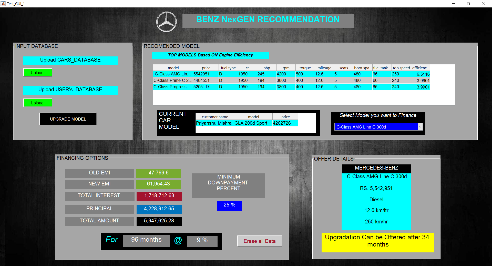

# MERC-BENZ-GUI
This GUI is created in Mercedes Benz digital challenge-2019
According to solution proposed from our side we have developed Graphical User Interface(GUI or UI) Using >>guide command in MATLAB 2018a(9.4). This UI so created can be compiled and converted into an Standalone application file which can run on any system with or without  MATLAB pre-installed on it.
The main file to needed execute GUI is  **Test_GUI_1.m** . On executing this code it calls various other functions already created in other matlab files within the same directory(**MR-BENZ-GUI/**) :
## INSTRUCTIONS
### for running code on Matlab_2018a or higher versions
1.	Test_GUI_1.fig >> This is figure file containing data regarding the User interface. It is always execute when you run the main matlab file.
2.	price_sort.m >>  func.  that sort whole car data inputted on the basis of the price of the car owned by the user.
3.	engcmp.m >> func. compares the engine of two cars on the basis on different efficiencies (thermal, volumetric, engine.coff.performance) and returns an overall efficiency between 2 engines.
4.	emical.m >> fucn. takes input as loan, rate and term and returns the emi calculated.
5.	monthused.m >> this calculated the time difference in months between 2 different  dates.(basically calculating months for which the car has been used )
6.	addComma >> it returns standard currency form of the number inputted as string.

*	On executing the main file on MATLAB 2018a or higher versions will provide a User Interface which will require Car models DATA and User     DATA (which contains User car details and his current financial contract) in .txt, .dat, or .csv for delimited text files  . xls, .xlsb,   .xlsm, .xlsx, .xltm, .xltx, or .ods . If any error occurred during reading the data file UI will report it to the user with specified       error.
*	When the both data are successfully read by the program it turns the upload button symbol green from Black signifying the user of
  success.
*	To find the upgrade model of the user>> click Upgrade Model button >> it compares the current user model with total models entered based on their engine efficiencies and returns top 3 models based on this comparison.
*	It automatically provides all the offer details of the 1st model including the expecting time from current after which this offer can be made.
*	Then automatically program refinance the new model and presents new financial details (new emi, interest, total amount) with a minimum down-payment of 20% if this downpayment is not satisfied then UI will increase the downpayment each time by 1% until the condition will satisfied. 
*	For User’s convenience an extra pop-up menu is also provided to select any car model from the top 3 ones and refinance it automatically.  

### for standalone application

* Execute the MyAppInstaller_web setup on any windows OS.
* The setup will automatically download Matlab runtime compiler for executing the application.
* Instructions for the handling of application is same as described above.. 

## NOVELTY

The current apps like Mercedes me and Mercedes Adapter are available only for car maintenance and drive related operations and help. The platform and apps that we are suggesting will be totally different from what present in current scenario although they are most simplistic ones to execute. The app will keep a track about the current contract status of the customer and all the details regarding his financing option. As mentioned in implementation plan, output of step 3 would be presented in the app and customer would be able to make a choice out of them. Whereas the software with the company would incorporate the step 4 also and would present a date after which offer can be made. There do exist some online platforms that help in predicting EMIs but they rarely consider the details that we are considering. Even companies predicting upgradations do not consider financing details and predict on the basis of model details only.

A Snapshot of GUI is Shown:

